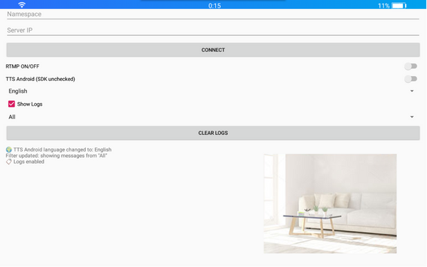
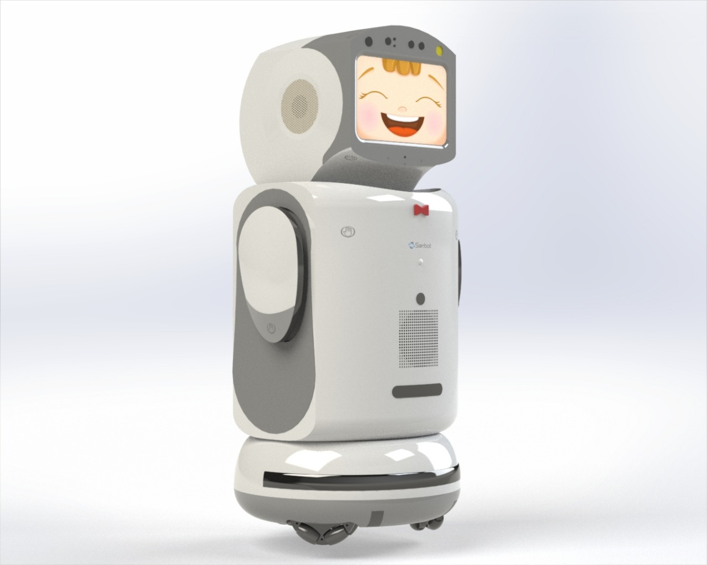
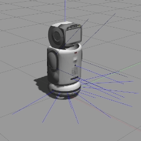
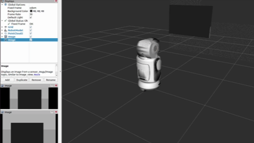

# sanbot-ros

This repository acts as a bridge between **Sanbot robots (Nano, Elf and Max)** and a **ROS 1 package** (`sanbot_ros/`) through an **Android application** (`Sanbot_Ros_Bridge/`). The app is built in Android Studio and uses both the official [Sanbot SDK](http://blue.sanbotcloud.com:98/dev/docs/robot.html) and communication protocols such as **MQTT** (for sensor data and control commands) and **RTMP** (for camera streaming).

A model of the **Sanbot Nano** (the only model I have on hand) was also created for Gazebo simulation (`sanbot_nano_urdf/`). An approximate representation was modelled in **SolidWorks 2023** (`sanbot_nano_solidworks/`).

## Installation

```bash
cd ~/catkin_ws/src
git clone https://github.com/lucashudson-eng/sanbot-ros.git
cd ~/catkin_ws
catkin_make
source devel/setup.bash
```

## Sanbot_OpenSDK20191118/

This app is provided only as a reference for developing Android Studio applications that use the SDK to acquire data from—​and send commands to—​Sanbot robots.

## Sanbot_Ros_Bridge/

This app serves as a bridge between the robot and a ROS 1 package, the framework most commonly used to communicate with robots or robotic platforms.

Because native ROS support on Android is still complex, the application relies on MQTT, which follows the same publisher/subscriber paradigm, to send sensor data and receive control commands, and on RTMP for efficient camera streaming.



The top section includes a **Namespace** field, which is required when connecting multiple robots so that each one publishes and receives commands within its own /namespace. If this option is used, the `sanbot_ros/` node must also be launched with the corresponding namespace (`__ns:=`).

It also coints a field to enter the **PC IP address** running the ROS package (`sanbot_ros/`) together with the MQTT and RTMP servers (`docker_mqtt_rtmp/`).

The middle section offers several settings:
- **Enable RTMP** – turns camera streaming on or off.
- **TTS source** – choose between the SDK TTS (English or Chinese) or the Android native TTS (all languages).
- **TTS language**.
- **Log topics** – select which topic to display in the log area, all or none.
- **Clear logs**.

The bottom area shows the messages sent/received via MQTT. When RTMP is enabled, a live video preview appears on the right.

## docker_mqtt_rtmp/

This Dockerfile starts a local MQTT broker (Mosquitto) and an RTMP server (NGINX).

While configuring an MQTT broker on Ubuntu is straightforward, setting up an RTMP server is not, which is why Docker is preferred.

The default ports are 1883 and 1935. If they are already in use, stop the corresponding processes before running the container.

```bash
cd ~/catkin_ws/src/sanbot-ros/docker_mqtt_rtmp
docker build -t sanbot_mqtt_rtmp .
docker run -d --name sanbot_mqtt_rtmp --restart unless-stopped -p 1883:1883 -p 1935:1935 sanbot_mqtt_rtmp
```

## sanbot_ros/

This package was developed in ROS 1 to interface with the app (`Sanbot_Ros_Bridge/`) and communicate with a Sanbot robot. Development and testing were done on Ubuntu 20.04 with ROS Noetic.

It provides topics for both sensor readings (touch, IR, IMU) and robot control (LEDs, head movement, wheels, speech), as well as camera streaming control.

Remember that the MQTT broker and RTMP server must be running locally, either via the supplied Docker image or your own setup.

```bash
pip install -r ~/catkin_ws/src/sanbot-ros/sanbot_ros/requirements.txt
roslaunch sanbot_ros app_bridge.launch
```

## sanbot_nano_solidworks/

To create the Sanbot Nano model for Gazebo, an approximate model was drawn in SolidWorks 2023.

The robot’s overall dimensions were respected (848.32 mm × 395.22 mm × 420.59 mm), but each part was sized to achieve the best real-world proportions. Not all curves were reproduced to keep modelling manageable.

The focus was on enabling accurate simulation, including moving parts and as many sensors as possible.



## sanbot_nano_urdf/

Using the SolidWorks model, URDF files were exported to build the simulation in Gazebo.

All moving parts function in the simulation, including the head (2 DOF, 180° horizontal, 37° vertical), wings (1 DOF each side, 270°) and wheels (3 DOF, free rotation).

Some sensors are implemented, such as the 17 infrared sensors and the IMU. Touch sensors could be added later using a Contact plugin.

All three cameras were added—​the two HD cameras and the stereo camera—​even though not all are available for streaming on the real robot. Camera settings in the simulation use their defaults because little construction data exists.

```bash
roslaunch sanbot_nano_urdf gazebo.launch
```

<div style="display: flex; gap: 10px;">
  
  
</div>

## Running

Follow the per-folder READMEs for more details.

Run the Nano simulation (`sanbot_nano_urdf/`) or connect to real hardware (`sanbot_ros/`) through the bridge app (`Sanbot_Ros_Bridge/`).

## Tests and Contributions

The only robot I have for testing is a Sanbot Nano running version 1.5.7.118. I also obtained version 1.10.41.118, but its HardwareManager keeps crashing.

Therefore, some features do not work even with the official demo app (`Sanbot_OpenSDK20191118/`). These problems appear to stem from the SDK or incompatibilities between versions, since everything works fine in the robot’s own Hardware Test utility. The non-functional features are:

- **Head horizontal movement (pan)** – when I send a pan command, it moves the vertical (tilt) axis instead.
- **Wing movement** – the documentation mentions a `WingMotionManager`, but I only found `HandMotionManager` and `FingerMotionManager` in the SDK, which might belong to the Max model and have no effect on the Nano.
- **Speed control** – when controlling head and wheel movement, the speed parameter is ignored.
- **LEDs** – some body parts control LEDs don't work as expected.
- **3D camera** – is it possible to capture data from this camera? It is not described in the SDK, but maybe Android allows access, similar to the other HD camera that the SDK also omits.

**If you test the repository on different models or versions, feedback on functionality is welcome.**

**If you have solutions for the listed problems or more experience with Sanbot robots, please share!**

**Pull requests and issues are encouraged.**

## License

This project is licensed under the MIT License – see the [`LICENSE`](LICENSE) file for details.
